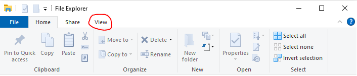
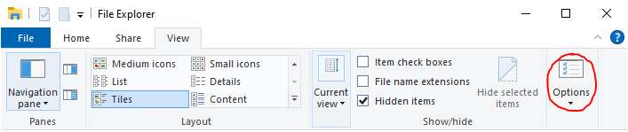
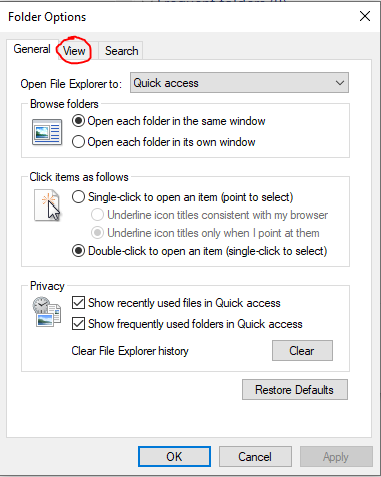
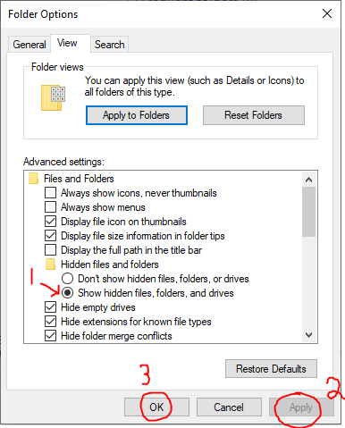
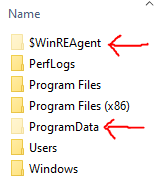

# View Hidden Files

1. Start by opening File Explorer and navigating to the **View** tab&#x20;

<figure><figcaption></figcaption></figure>

2. Now click **Options**&#x20;

<figure><figcaption></figcaption></figure>

3. Navigate to the **View** tab&#x20;

<figure><figcaption></figcaption></figure>

3. Now click the box that says **Show hidden files, folders, or drives,** and proceed to select **Apply** then **OK**.&#x20;

<figure><figcaption></figcaption></figure>

4. You can now see hidden files. You can see hidden files now appear dulled&#x20;

<figure><figcaption></figcaption></figure>
