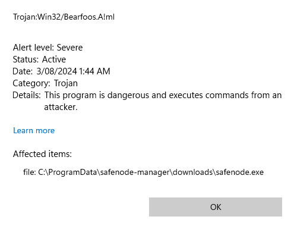
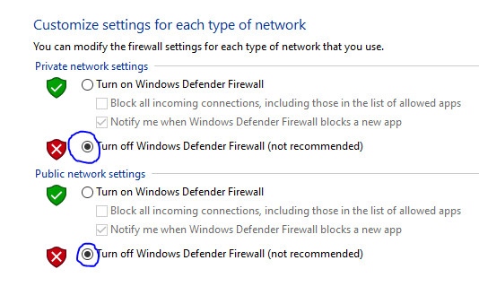
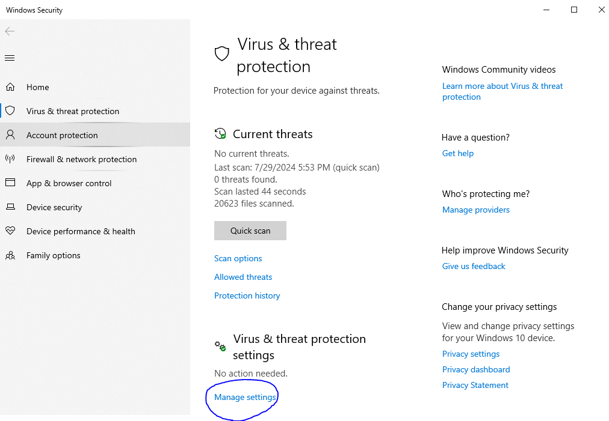
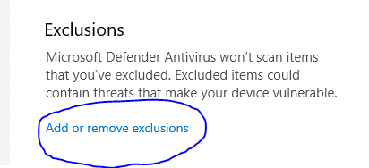
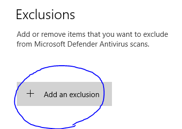
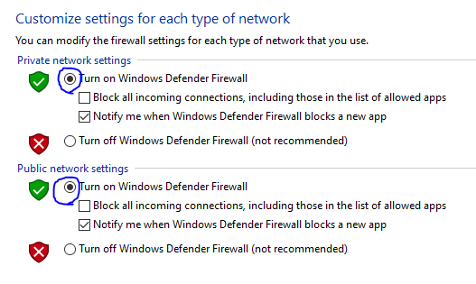

# Node Launchpad Blocked as a Virus

Here's how your can disable the anti-virus software for the Node Launchpad, and safely install it

<figure><figcaption>
If you have run into this message when installing the the launchpad, follow the instructions below
</figcaption></figure>

To remedy this, we need to disable the anti-virus software.&#x20;

1. Head to **Control Panel** -> **Systems and Security** -> **Windows Defender Firewall** -> **Turn Windows Defender Firewall on or off**. &#x20;
2. Now make sure to click the 2 boxes to turn off the firewall (pictured below), and click **OK**.&#x20;

<figure><figcaption></figcaption></figure>

3. Once that is complete, you will be able to [**download**](https://docs.autonomi.com/getting-started/autonomi-beta/downloads) **and extract the node-launchpad.exe** file.&#x20;
4. Next, hit the Windows key and search for **Virus & threat protection**. Now click **Manage settings** (pictured below). &#x20;

<figure><figcaption></figcaption></figure>

5. Now you need to click **Add or remove exclusions** (pictured below).&#x20;

<figure><figcaption></figcaption></figure>

6. Now you need to click **+ Add an exclusion** (pictured below) -> **File** -> then select the path of your **EXE file**.&#x20;

<figure><figcaption></figcaption></figure>

7. Now  **turn your firewall back on** (pictured below). Now you should be all set to run the EXE. Remembering to **run it as an administrator**.&#x20;

<figure><figcaption></figcaption></figure>
